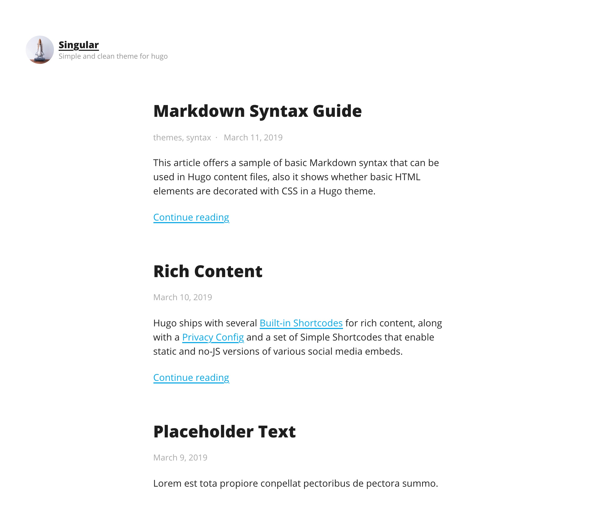

# Singular - Simple and Clean Theme for Hugo



## Development

```
git clone https://github.com/yasuoza/hugo-theme-singular.git singular
cd singular
make docker/server   # Requires docker
open localhost:1313  # or open http://localhost:1313 in browser manually
```

## LICENSE

- GNU General Public License v2 or later

## Acknowledgements

Singular is developed based on [Integer](https://ja.wordpress.org/themes/integer/) theme for wordpress.
